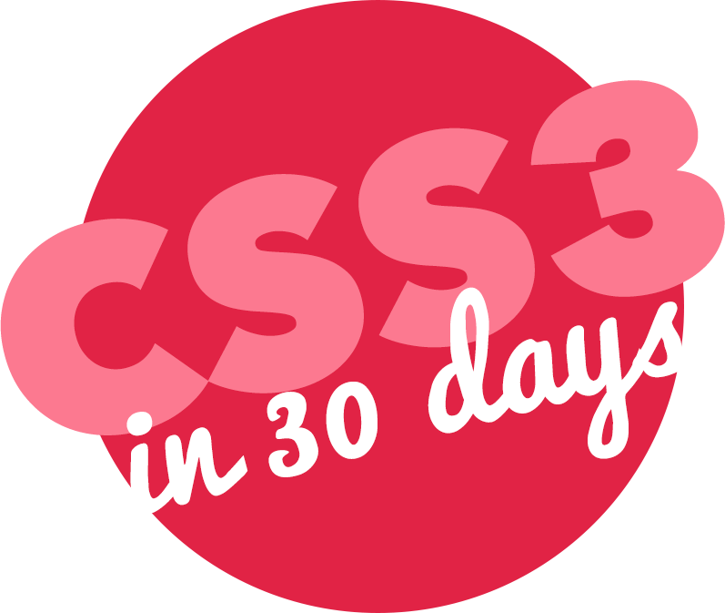

# CSS3-Course

  
Shoutout to Thiago for doing this course with me https://github.com/psychoCS  
  
Design:  
1 - Fancy Buttons  
2 - Sexy Typography  
9 - Modern Layouts  
22 - Flexbox Layouts  
  
Images:  
26 - 3D Layers  
29 - Blurry Effect  
3 - Clipping Images  
5 - Useful Broken Images  
7 - Image Manipulation  
  
Features:  
23 - CSS3 Accordion  
25 - Sliding Panels  
27 - Dropdown Menu  
4 - Sexy Registration Form  
10 - Pricing Table  
13 - Sticky Footer  
14 - Sticky Header  
15 - Sticky Sidebar  
16 - Modal Window  
18 - Tooltips  
  
Animations:  
19 - Animated Progress Bars  
20 - Animated Pyramid  
21 - Spinners  
30 - CSS3 Coffee  
8 - 8-bit Mario  
17 - Pacman  
  
Extras:  
28 - Optimizing CSS  
6 - Print Styles  
11 - IE Hacks  
12 - CSS Variables  
  
